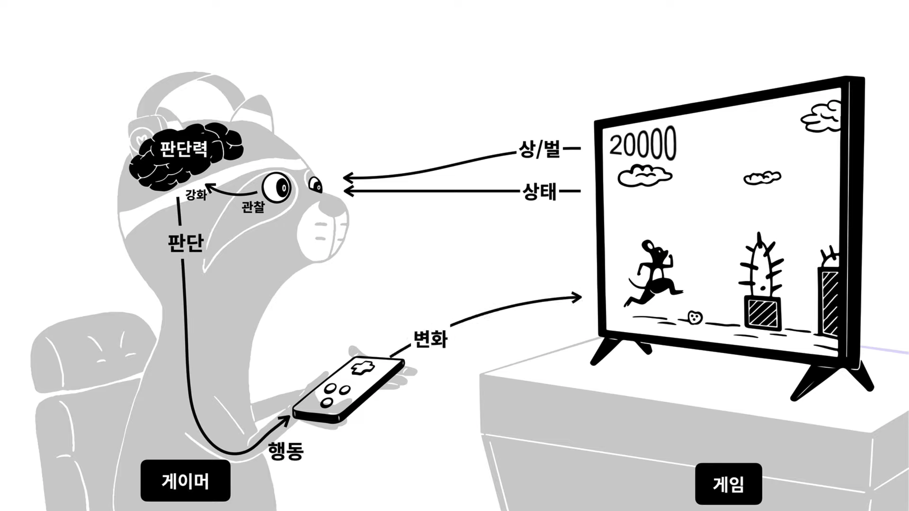
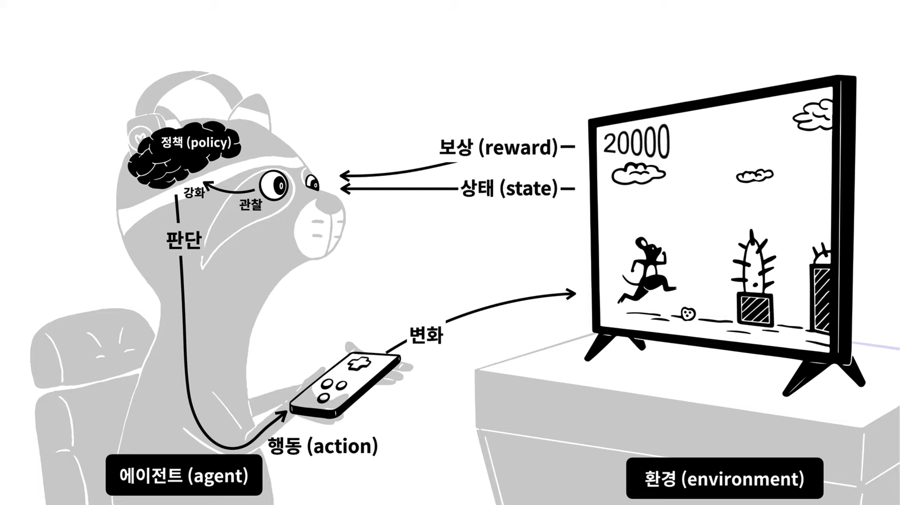

---
tags:
  - opentutorials
  - machine-learning
---

# 머신러닝1

<https://opentutorials.org/course/4548>

## 표

- 행(row): instance, observed value, record, example, case
- 열(column): feature, attribute, variable, field

## 독립변수와 종속변수

- 독립 변수(independent variable): 원인
- 종속 변수(dependent variable): 결과
- 인과관계: 독립변수와 종속변수의 관계
- 상관관계: 두 변수가 어떤 연관성을 가지고 있음. 모든 인과관계는 상관관계임

## 기계학습의 분류

### 지도학습(Supervised Learning)

독립 변수 + 종속 변수 데이터셋을 바탕으로 학습

- 분류(Classification): 종속 변수가 범주적인 데이터일 때
- 회귀(Regression): 종속 변수가 양적 데이터일 때

### 비지도학습(Unsupervised Learning)

- 군집화(Clustering)
	- 비슷한 것을 찾아 그룹화
	- 분류와의 비교: 분류는 각 데이터에 라벨을 붙이는 것, 군집화는 그냥 그룹화만 함
	- record를 그룹화
- 연관(연관규칙학습, Association Rule Learning)
	- 장바구니 학습
	- 추천 알고리즘에 주로 쓰임
	- feature를 그룹화
- 변환(Transform)

### 강화학습(Reinforcement Learning)

- 지도학습과의 비교: 강화학습은 경험을 통해, 지도학습은 배움을 통해 학습
- reward 기반 학습

<PageTags />
